# Oosu / 우수

### Product Engineer · Applied AI · Industrial Systems

<a href="https://www.gitanimals.org/en-US?utm_medium=image&utm_source=oosuhada&utm_content=farm">
  <picture>
    <source media="(prefers-color-scheme: dark)" srcset="assets/gitanimals/farm-dark.svg?v=1788494717462">
    <source media="(prefers-color-scheme: light)" srcset="assets/gitanimals/farm-light.svg?v=1788494717462">
    
  </picture>
</a>

> ### I start with real problems and friction, then build products and systems people can actually use.

> ### 실제 문제와 불편에서 시작해, 직접 쓸 수 있는 제품과 시스템을 만듭니다.

 

When I find friction in a team, at work, or in everyday life, I build a working version first. 
With a background in business and product planning, I structure ambiguous user and operational needs and translate them into working software. 
Rather than planning for perfection, I use what I build, fix what is still awkward, and keep iterating until it is ready to ship and operate. 
I work across product, AI, data, and engineering — owning the path from problem discovery to deployment and real-world use.

팀 과제, 회사 업무, 일상에서 불편한 점을 발견하면 먼저 작동하는 버전을 직접 만듭니다. 
경영학적 문제 정의와 제품 기획을 바탕으로, 사용자와 현업의 요구를 구조화하고 제품으로 구현합니다. 
완벽하게 계획하기보다 직접 써보고, 불편한 부분을 고치면서 배포하고 운영할 수 있는 수준까지 발전시킵니다.

## Featured Projects / 대표 프로젝트

<table width="100%">
  <tbody>
    <tr>
      <td>
        <h2>Agentic Ontology Dashboard <a href="https://dashboard.oosu.dev/app"><strong>Live Demo</strong></a> <strong>·</strong> <a href="https://github.com/oosuhada/agentic-ontology-dashboard"><strong>Repository</strong></a></h2>
        
Engineers need raw numbers and evidence, managers need priorities, executives need conclusions — but one fixed dashboard can&#x27;t serve all three. I built a dynamic dashboard where an LLM reshapes the same manufacturing data for each role.

        
엔지니어는 수치와 근거를, 매니저는 우선순위를, 임원은 결론을 필요로 하는데, 하나의 고정된 대시보드로는 이 니즈가 동시에 충족되지 않는 문제가 있었습니다. 같은 제조 데이터를 각 역할에 맞게 LLM이 다시 구성하는 동적 대시보드를 만들었습니다.

        

        <h2>Dev Flow Dashboard <a href="https://ontology.oosu.dev/dev_dashboard"><strong>Live Demo</strong></a> <strong>·</strong> <a href="https://github.com/oosuhada/dev-flow-dashboard"><strong>Repository</strong></a></h2>
        
LLMs made coding faster, but that speed backfired — PRs piled up simultaneously, dependencies tangled, and merging one triggered a chain of rebases that consumed more time than the feature work itself. I built a dashboard that shows the team which PRs to review and merge first.

        
코드 작업에 LLM이 도입되면서 개발 속도는 빨라졌지만, 오히려 PR이 동시다발적으로 쌓이면서 병목이 생기기 시작했습니다. 하나를 머지하면 나머지를 연쇄적으로 rebase해야 하고, 기능 구현보다 PR 정리에 시간이 더 드는 상황이 반복됐습니다. 뭐부터 리뷰하고 머지해야 하는지 팀 전체가 한눈에 볼 수 있는 화면을 만들었습니다.

        

        <h2>KAIST BTM Prep <a href="https://kaist.oosu.dev"><strong>Live Demo</strong></a> <strong>·</strong> <a href="https://github.com/oosuhada/kaist-btm-interview-prep"><strong>Repository</strong></a></h2>
        
Before my KAIST graduate-school interview, I had answers organized in Notion — but reading them over and over didn&#x27;t help. I could recognize the material, yet the words wouldn&#x27;t come out when asked aloud. I turned those notes into spoken, visual, and musical recall drills modeled after the musicals I already listen to every day.

        
카이스트 대학원 면접 일정이 급하게 잡히고 나서, 예상 질문과 답변은 Notion에 정리해두고 읽어봤지만 머리에 남지 않았습니다. 눈으로 보면 아는 내용인데 질문을 받으면 입에서 나오지 않는 게 문제였습니다. 평소 매일 듣던 뮤지컬 넘버처럼, 말하고 듣고 보고 반복하는 회상 도구로 바꿔서 만들었습니다.

        

        <h2>CodeMap AI <a href="https://oosu.dev/codemap/example/"><strong>Live Demo</strong></a> <strong>·</strong> <a href="https://github.com/oosuhada/codemap-share"><strong>Repository</strong></a></h2>
        
When stepping into a new project at work, it took two full weeks just to understand an unfamiliar codebase before I could make changes confidently. I built CodeMap AI to compress that onboarding time with LLMs — and turn codebase understanding into a shared workspace the team can explore together, much like Google Docs did for documents.

        
새로운 현업 프로젝트에 투입되어 낯선 코드베이스를 파악하는 데만 2주가 걸렸습니다. 그 온보딩 시간을 LLM으로 줄이고 싶었고, 더 나아가 코드를 이해한 맥락 자체를 팀이 함께 탐색하는 공간으로 만들고 싶었습니다. 마치 Google Docs가 문서를 협업 공간으로 바꾼 것처럼, 코드베이스 이해도 함께 공유될 수 있다고 생각했습니다.

        

        <h2>AskOosu <a href="https://oosu.dev"><strong>Live Demo</strong></a> <strong>·</strong> <a href="https://github.com/oosuhada/AskOosu"><strong>Repository</strong></a></h2>
        
My previous portfolio, Portfoli-Oh!, kept getting heavier because I tried to show every feature I could build. It even had a chatbot, but visitors had to click through too many screens to reach it. AskOosu flips that entirely — the conversation is the portfolio, so visitors just ask what they&#x27;re curious about.

        
이전 포트폴리오 Portfoli-Oh!는 구현할 수 있는 기능을 전부 보여주려다 계속 무거워졌습니다. 챗봇도 넣었지만 거기까지 도달하려면 여러 화면을 거쳐야 했습니다. AskOosu는 방향을 완전히 뒤집어서, 대화 자체가 포트폴리오가 되게 만들었습니다. 궁금한 게 있으면 바로 물어보면 됩니다.

        

        <h2>Algolog <a href="https://github.com/oosuhada/codetestlog-extension"><strong>Repository</strong></a></h2>
        
I used BaekjoonHub while solving coding tests, but it only committed the final accepted answer to Git and the entire trial-and-error, problem-solving process disappeared. Instead of keeping a separate journal, I forked the open-source extension and rebuilt it to record every submission automatically.

        
코딩테스트를 풀면서 BaekjoonHub를 쓰고 있었는데, Git에는 최종 정답만 커밋되고 끝이었습니다. 몇 번 틀렸는지, 얼마나 걸렸는지, 어떤 코드가 오답이었는지, 풀이 과정 전체가 사라졌습니다. 따로 기록하는 대신 오픈소스를 fork해서 모든 제출을 자동 기록하도록 직접 고쳤습니다.

        

        <h2>Sticks &amp; Stones <a href="https://stks.oosu.dev"><strong>Live Demo</strong></a> <strong>·</strong> <a href="https://github.com/oosuhada/sticksandstones.kr"><strong>Repository</strong></a></h2>
        
The site relied on a decade-old WordPress setup tangled with patches from different developers over the years, making routine maintenance practically impossible. I took the initiative to migrate the entire frontend, which directly led to a contract extension. Since proprietary code cannot be shared, this repository is a case study documenting the architectural choices and before/after results.

        
10년 가까이 서로 다른 개발자들의 패치가 누적된 오래된 WordPress 사이트라 코드베이스가 심각하게 엉켜 있었고, 단순 유지보수로는 감당이 안 되는 상태였습니다. 결국 프론트엔드를 직접 새로 마이그레이션했고, 그 성과로 계약 연장까지 이어졌습니다. 원본 코드는 비공개라 기술적 판단과 before/after 결과를 정리한 case study로 재구성했습니다.

        
&nbsp;

      </td>
    </tr>
  </tbody>
</table>

## More Projects / 더 많은 프로젝트

<table width="100%">
  <tbody>
    <tr>
      <td>
        <h2>Text-to-Cypher Factory RCA <a href="https://text2cypher.oosu.dev"><strong>Live Demo</strong></a> <strong>·</strong> <a href="https://github.com/oosuhada/text2cypher-factory-rca"><strong>Repository</strong></a></h2>
        
Before building the Ontology Dashboard, I needed to prove one thing first: can a natural-language question actually trace root causes through a manufacturing knowledge graph and return real evidence — not just unsupported LLM prose? This MVP answered that question and shaped the grounded-report design of the main dashboard.

        
Ontology Dashboard를 본격적으로 만들기 전에 먼저 확인해야 할 게 있었습니다. 자연어 질문이 제조 지식그래프를 따라 실제 근거까지 추적할 수 있는지, LLM이 근거 없이 답변을 지어내는 게 아닌지. 이 선행 MVP로 그 가정을 검증했고, 결과가 본 대시보드의 grounded report 설계로 이어졌습니다.

        

        <h2>GitAnimals for VS Code <a href="https://github.com/oosuhada/gitanimals-vscode"><strong>Repository</strong></a></h2>
        
Inspired by a teammate using a Pokémon extension in VS Code, I wanted that same experience for the GitAnimals which was already connected to my GitHub commits. Bringing my pet farm and live contribution count directly into the editor makes every commit feel rewarding.

        
옆자리 동료가 포켓몬 확장 프로그램을 띄워두고 코딩하는 걸 보고 영감을 받았습니다. 이미 git과 연결되어 있던 GitAnimals의 실시간 contribution를 개발 환경에 항상 띄워두면 작은 커밋 하나하나가 훨씬 뿌듯할 것 같았습니다. 그래서 VS Code 안으로 가져왔습니다

        

        <h2>Nulltone <a href="https://github.com/oosuhada/nulltone"><strong>Repository</strong></a></h2>
        
macOS evolved with a sleek, translucent Liquid Glass UI, but existing VS Code themes were all too vivid to match that system-level tone and manner. I built Nulltone to eliminate that visual disconnect and bring the translucent aesthetic and design language of modern macOS right into the editor.

        
macOS가 리퀴드 글라스(Liquid Glass)로 개편되면서 특유의 투명하고 세련된 UI로 바뀌었는데, VS Code에는 너무 vivid한 테마들뿐이라 톤앤매너가 전혀 맞지 않았습니다. 에디터만 따로 노는 이질감을 없애고, macOS의 투명한 감성과 자연스럽게 어우러지는 개발 환경을 만들기 위해 직접 제작했습니다.

        

        <h2>iBridge Studio <a href="https://github.com/oosuhada/iBridge-Studio"><strong>Repository</strong></a></h2>
        
Developing on a MacBook created a clear need for an external display that matched its sharp 5K Retina resolution. Rather than simply purchasing an expensive Apple 5K display, I realized I could repurpose the 5K iMac I already owned — and built a software solution to bypass the discontinued Target Display Mode on older iMacs.

        
MacBook 환경에서 개발하면서 내장 화면만큼 선명한 5K 고화질 외장 모니터에 대한 니즈가 있었습니다. 고가의 Apple 5K 디스플레이를 구매하기보다, 집에 이미 가지고 있던 5K iMac 패널을 직접 활용할 수 있겠다는 생각이 들었습니다. 공식 지원이 끊긴 구형 iMac의 Target Display Mode 문제를 소프트웨어 방식으로 직접 해결해 외장 모니터로 재탄생시켰습니다.

        

        <h2>Lingo <a href="https://lingo.oosu.dev"><strong>Live Demo</strong></a> <strong>·</strong> <a href="https://github.com/oosuhada/Lingo"><strong>Repository</strong></a></h2>
        
Basic Python and Java syntax kept tripping me up with small mistakes during coding tests. Reading never stuck for me the way daily Duolingo practice did, so I borrowed that same game-like approach to make learning syntax fun again — and built a tool around it.

        
코딩테스트를 풀 때 Python·Java 기초 문법에서 사소한 실수들이 반복되었습니다. 책으로 외우기보다 매일 하던 Duolingo 방식이 훨씬 재밌고 오래 기억에 남았던 터라, 그 방식을 차용해서 더 재밌게 문법을 학습할 수 있는 도구를 만들어봤습니다.

        

        <h2>Webtoon AI Translate <a href="https://webtoon.oosu.dev"><strong>Live Demo</strong></a> <strong>·</strong> <a href="https://github.com/oosuhada/webtoon-ai-translate"><strong>Repository</strong></a></h2>
        
A close friend at a webtoon translation company kept venting about an in-house tool that had gone unmaintained since the dev team disbanded. I interviewed him to build something beyond a single fixed answer — an OCR + LLM workflow tool that offers multiple options consistent with the existing translation context, so translators can easily adopt or edit them.

        
웹툰 번역 회사에 근무하는 친구가 개발팀 해체 후 유지보수가 이뤄지지 않고 있는 사내 번역 도구에 대해 지속적으로 불만을 토로했습니다. 친구를 인터뷰해, 하나의 정답만 내놓는 방식이 아니라 기존 번역 맥락과 어울리는 여러 옵션을 제시해 번역가가 쉽게 채택하고 수정할 수 있는 OCR + LLM 워크플로우 툴을 만들었습니다.

        

        <h2>Aigram <a href="https://aigram.oosu.dev"><strong>Live Demo</strong></a> <strong>·</strong> <a href="https://github.com/oosuhada/Aigram"><strong>Repository</strong></a></h2>
        
Starting from a familiar product I used daily, I wanted to move beyond surface-level cloning to solve real friction in an AI-enhanced Instagram. I implemented AI summaries for lengthy captions and comment threads, cached translations in the database to eliminate wasteful duplicate API calls, and engineered idempotent handlers for rapid consecutive likes along with fast search.

        
평소 자주 쓰던 친숙한 도메인에서 출발하되, 단순 UI 재구현에 머물지 않고 실제 불편을 개선하는 미래형 인스타그램을 구상했습니다. 긴 피드 본문과 방대한 댓글을 AI로 요약하고, 중복 번역 API 호출을 막기 위해 결과를 DB에 캐싱하며, 연속적인 &#x27;좋아요&#x27; 클릭에 대응한 멱등성과 빠른 검색까지 고려하며 사용자 경험과 시스템 비용 문제를 함께 해결했습니다.

        

        <h2>EZ AIR <a href="https://ezair.oosu.dev"><strong>Live Demo</strong></a> <strong>·</strong> <a href="https://github.com/oosuhada/ezair.ai"><strong>Repository</strong></a></h2>
        
Flight search involved tedious friction — returning to the home screen to reset filters for every minor date change and juggling separate notes just to compare options. With conversational LLMs emerging but not yet applied to flight booking, I built a natural-language search product where travelers can adjust conditions and compare itineraries seamlessly through plain dialogue.

        
항공권을 검색할 때 날짜나 도시를 바꾸려면 매번 홈 화면으로 돌아가 폼을 처음부터 다시 채워야 했고, 여러 조건을 비교하려면 따로 메모해야 하는 번거로움이 있었습니다. 당시 LLM과 챗봇 기술이 급부상하고 있었지만 항공권 검색에 접목된 서비스는 없었기에, 대화 한 번으로 조건 변경과 일정 탐색을 끝낼 수 있는 자연어 항공권 검색을 구현했습니다.

        
&nbsp;

      </td>
    </tr>
  </tbody>
</table>

## Stack / 기술 스택

> ### Technology comes after purpose. I connect web, mobile, AI, data, and infrastructure around the needs of each problem.

> ### 기술은 목적보다 뒤에 둡니다. 필요한 문제에 맞춰 웹·모바일·AI·데이터·인프라를 연결합니다.

 

<a href="https://oosu.dev/stack">
  <picture>
    <source media="(prefers-color-scheme: dark)" srcset="assets/stack/stack-timeline-dark.svg">
    <source media="(prefers-color-scheme: light)" srcset="assets/stack/stack-timeline-light.svg">
    
  </picture>
</a>

↑ Click the timeline to explore the live, GitHub-backed stack page.

## Architecture & Topics / 아키텍처 및 주제

**Software Architecture :** [`domain-driven-design`](https://github.com/topics/domain-driven-design) · [`hexagonal-architecture`](https://github.com/topics/hexagonal-architecture) · [`event-driven-architecture`](https://github.com/topics/event-driven-architecture) · [`modular-monolith`](https://github.com/topics/modular-monolith) · [`transactional-outbox`](https://github.com/topics/transactional-outbox) · [`stateful-workflows`](https://github.com/topics/stateful-workflows) · [`clean-architecture`](https://github.com/topics/clean-architecture) · [`cqrs`](https://github.com/topics/cqrs) · [`contract-driven-development`](https://github.com/topics/contract-driven-development) **Applied AI :** [`multimodal-ai`](https://github.com/topics/multimodal-ai) · [`vision-language-model`](https://github.com/topics/vision-language-model) · [`retrieval-augmented-generation`](https://github.com/topics/retrieval-augmented-generation) · [`agentic-ai`](https://github.com/topics/agentic-ai) · [`hybrid-retrieval`](https://github.com/topics/hybrid-retrieval) · [`human-in-the-loop`](https://github.com/topics/human-in-the-loop) · [`semantic-search`](https://github.com/topics/semantic-search) · [`multi-agent-systems`](https://github.com/topics/multi-agent-systems) · [`knowledge-graph`](https://github.com/topics/knowledge-graph) **Decision & Evidence Systems :** [`decision-intelligence`](https://github.com/topics/decision-intelligence) · [`provenance-tracking`](https://github.com/topics/provenance-tracking) · [`auditability`](https://github.com/topics/auditability) · [`workflow-engine`](https://github.com/topics/workflow-engine) · [`state-machine`](https://github.com/topics/state-machine) · [`evaluation-driven-development`](https://github.com/topics/evaluation-driven-development) · [`evidence-first-architecture`](https://github.com/topics/evidence-first-architecture) · [`versioned-state`](https://github.com/topics/versioned-state) · [`data-lineage`](https://github.com/topics/data-lineage) **Industrial & Operational Systems :** [`industrial-ai`](https://github.com/topics/industrial-ai) · [`digital-twin`](https://github.com/topics/digital-twin) · [`discrete-event-simulation`](https://github.com/topics/discrete-event-simulation) · [`reliability`](https://github.com/topics/reliability) · [`synthetic-data`](https://github.com/topics/synthetic-data) · [`ai-engineering`](https://github.com/topics/ai-engineering) · [`simulation-driven-design`](https://github.com/topics/simulation-driven-design) · [`closed-loop-control`](https://github.com/topics/closed-loop-control) · [`observability`](https://github.com/topics/observability)
